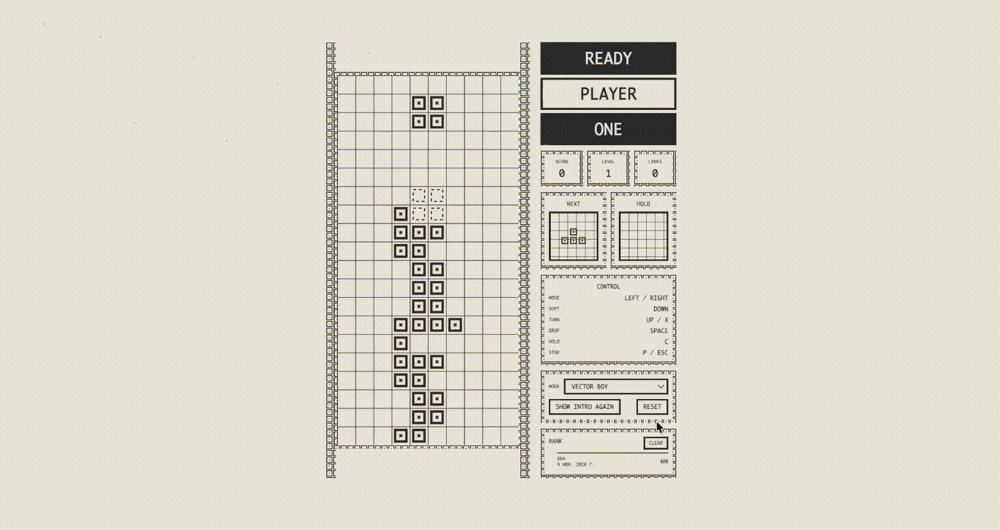
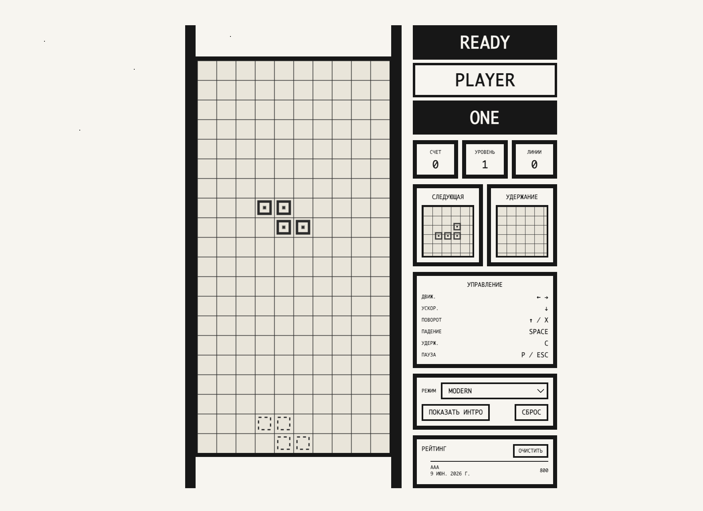
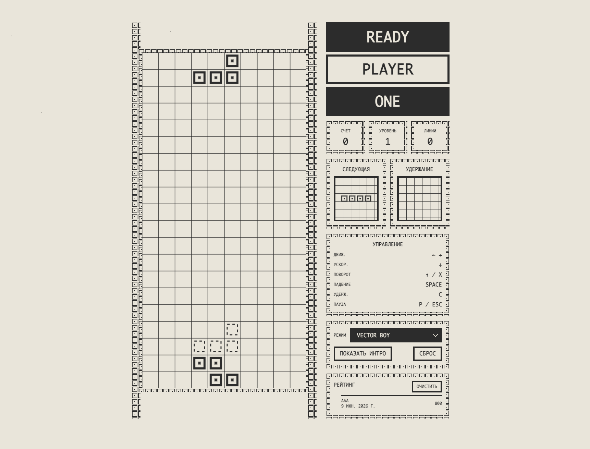
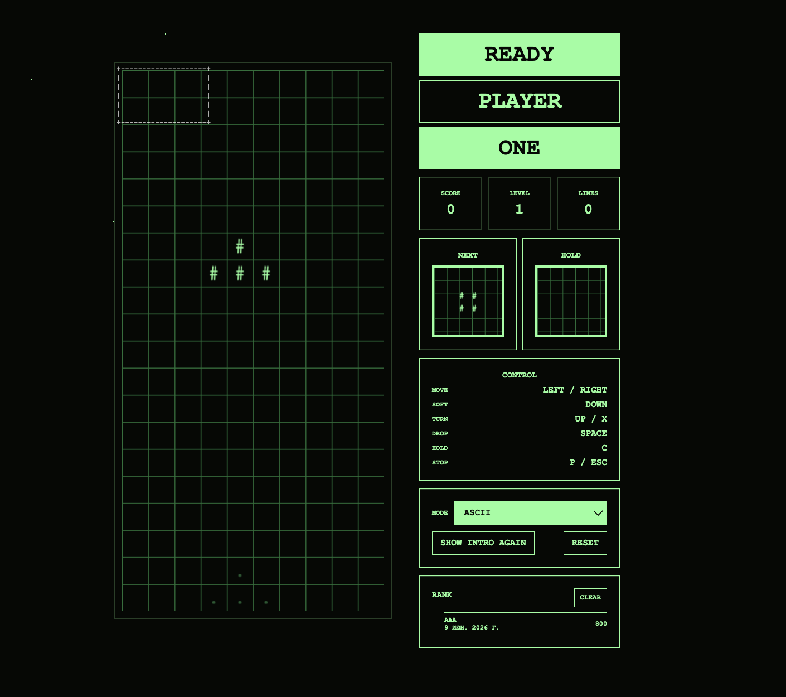
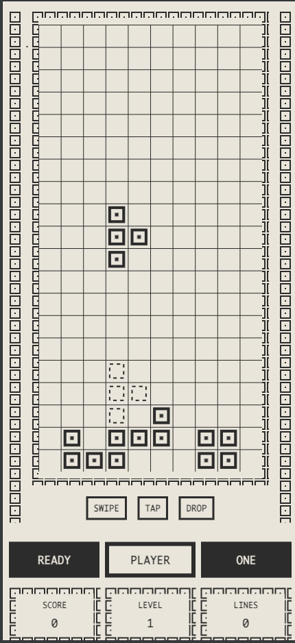

# Canvas Tetris

Полный классический клон Тетриса, построенный на HTML5 Canvas, чистом JavaScript (Vanilla JS), HTML и CSS. Это статический проект, который можно развернуть напрямую через GitHub Pages без дополнительных шагов сборки.

## Особенности (Features)

- **Игровое поле 10 x 20:** Классический размер сетки, плавно отрисовываемый через HTML5 Canvas API (разрешение `320x640px`, размер ячейки `32px`).
- **Все 7 классических тетрамино:** Точно смоделированные матрицы для фигур `I`, `O`, `T`, `L`, `J`, `S` и `Z`.
- **Рандомайзер 7-Bag:** Реализует современные правила Тетриса с использованием алгоритма тасования Фишера-Йетса, что исключает появление длинных серий из «неудачных» фигур.
- **Игровой цикл на базе времени:** Использует метод `requestAnimationFrame` с точным аккумулятором времени (`delta`), благодаря чему скорость падения фигур не зависит от частоты обновления монитора (FPS).
- **Поуровневая скорость:** Скорость падения увеличивается линейно каждые 10 очищенных линий на основе формулы: `Math.max(90, 900 - (level - 1) * 80) мс`.
- **Продвинутая механика:** Полная поддержка Soft Drop (ускоренное падение), Hard Drop (мгновенное падение), удержания фигуры (клавиша `C`), превью следующей фигуры и полупрозрачной проекции «призрака» (Ghost Piece).
- **Надежная система коллизий:** Динамическая проверка на уровне матриц (`hasCollision`), оценивающая границы стен, пола и уже зафиксированных блоков.
- **Матричный поворот и Wall Kicks:** Алгоритмический поворот матрицы на 90 градусов по часовой стрелке (транспонирование + реверс строк), работающий в связке с последовательностью смещений `[0, 1, -1]` при столкновениях со стенами.
- **Система очистки линий:** Обнаруживает заполненные ряды с помощью `row.every(Boolean)`, удаляет их одновременно через сопоставление индексов `Set` и поддерживает начисление очков за Single, Double, Triple и Tetris (4 ряда).
- **Визуальные эффекты:** Легковесная 220-миллисекундная флеш-анимация (вспышка) при очистке линий за счет динамического изменения прозрачности (альфа-канала) Canvas.
- **Локальная таблица Top-10:** Хранение рекордов в `localStorage` с автоматической сортировкой очков, prompt-валидацией инициалов игрока и фиксацией даты.
- **Синтезированный звуковой движок:** Построен полностью на **Web Audio API** с использованием аппаратно генерируемых узлов `OscillatorNode` и `GainNode` для озвучки поворотов, падений, очистки линий и Game Over — тяжелые внешние аудиофайлы не требуются.
- **Динамические темы:** Три адаптивные конфигурации интерфейса (Modern Beige, Retro Game Boy Green и Terminal ASCII Monochrome), плавно управляемые модулем `ThemeManager` в рантайме.
- **Мобильное Touch-управление:** Специализированные слушатели touch-событий, обрабатывающие жесты свайпов, резких падений и тапов.

## Управление (Controls)

| Действие | Клавиатура | Touch-жесты (Мобильные) |
| --- | --- | --- |
| **Движение влево** | `ArrowLeft` | Свайп влево |
| **Движение вправо** | `ArrowRight` | Свайп вправо |
| **Soft drop (Ускорение)** | `ArrowDown` | Медленный свайп вниз |
| **Поворот по часовой** | `ArrowUp` или `X` | Короткий одиночный Тап |
| **Hard drop (Мгновенно)** | `Space` (Пробел) | Быстрый резкий свайп вниз ($dy > 150px$) |
| **Удержание (Hold)** | `C` | — |
| **Пауза** | `P` или `Escape` | Нажатие на UI-кнопку паузы |

## Архитектура проекта (Architecture Overview)

Кодовая база построена строго по принципам объектно-ориентированного программирования (ООП) с соблюдением правила **Separation of Concerns (Разделение обязанностей)** между 7 функциональными модулями:

- `index.html` — определяет базовую разметку DOM-узлов, адаптивные вьюпорты, боковые панели статистики, выпадающие списки тем и оверлей таблицы лидеров.
- `style.css` — управляет кастомными CSS-свойствами (переменными), которые динамически внедряются классом `ThemeManager`, настраивает темные/светлые токены UI и контролирует границы сетки.
- `script.js` — содержит всю логику приложения, разделенную на специализированные классы:
  - `App`: главный оркестратор, связывает обработчики событий, координирует DOM-узлы, обновляет текстовые блоки интерфейса и управляет основным анимационным циклом.
  - `TetrisGame`: хранит абсолютное состояние игры, включая двумерный массив сетки поля, данные счета, уровней, линий и логику манипулирования матрицами.
  - `Renderer`: напрямую взаимодействует с `Canvas 2D Context` для отрисовки блоков ячеек, линий сетки, эффектов прозрачности и векторного текста.
  - `BagRandomizer`: контролирует пулы распределения фигур, удерживая внутренний массив, который автоматически перезапускает перемешивание Фишера-Йетса, как только пустеет корзина.
  - `AudioManager`: программно синтезирует звуковые частоты, проверяет наличие нативного аудиоконтекста браузера и инициализирует fallback-логику под `webkitAudioContext` для Safari.
  - `StorageManager`: взаимодействует с постоянным хранилищем key-value браузера для сохранения рекордов, выбранной локализации и стилей оформления.

Зафиксированное игровое поле хранится в виде двумерного массива `строк × колонок (20 × 10)` отдельно от активной падающей фигуры. Пустые ячейки обозначаются как `null`, а заполненные содержат объект с описанием блока: `{ type: "T", color: "#2C2C2C" }`.

## Технический Roadmap проекта (Self-Audit Notes)

На основе результатов преддеплойного аудита кодовой базы были сформированы следующие задачи для будущих спринтов рефакторинга:

1. **Рефакторинг цвета тетрамино (Исправление хардкода):** В текущей версии все фигуры внутри конфигурационного объекта `TETROMINOES` инициализированы с одинаковым hex-значением цвета `"#2C2C2C"`, из-за чего разделение по цветам полностью зависит от глобальных тем. Будущие исправления распределят уникальные каноничные цвета непосредственно объектам фигур (Cyan для `I`, Yellow для `O`, Purple для `T`, Orange для `L`, Blue для `J`, Green для `S`, Red для `Z`).
2. **Интеграция Super Rotation System (SRS):** Текущий упрощенный вектор смещений Wall Kick `[0, 1, -1]` успешно справляется с коллизиями у стен в 90% случаев. Однако длинная 4-ячеистая горизонтальная фигура `I` всё еще может не провернуться в тесных углах. Переход на полноценную матричную таблицу смещений SRS полностью решит этот крайний случай (edge case).
3. **Усложненная кривая скорости:** Изменение текущей формулы линейного вычитания времени (`-80мс` за уровень) на плавную экспоненциальную кривую прогрессии ($900 \times 0.85^{(\text{level}-1)}$) для оптимизации игрового баланса на высоких уровнях сложности.

## Развертывание на GitHub Pages (Deployment)

1. Сделайте коммит файлов `index.html`, `style.css`, `script.js` и `README.md`.
2. Отправьте (Push) репозиторий на GitHub.
3. В настройках репозитория (Repository Settings) перейдите во вкладку **Pages**.
4. Выберите ветку для развертывания, обычно это `main`.
5. Укажите корневую папку репозитория (`/root`) в качестве источника публикации.
6. Сохраните настройки и подождите несколько минут, пока GitHub Pages опубликует статический сайт.

Дополнительный этап сборки не требуется.

## Заглушки для скриншотов (Screenshot Placeholders)

Добавьте скриншоты сюда после деплоя или локального захвата экрана:

- `screenshots/modern-theme.png`
- `screenshots/gameboy-theme.png`
- `screenshots/mobile-layout.png`

## Заглушка для геймплейной GIF-анимации

Добавьте демонстрационную GIF-анимацию игрового процесса сюда:

- `media/gameplay-demo.gif`
- # Ответы для защиты проекта

## Структура данных

Игровое поле и активная фигура являются двумя независимыми сущностями.

Игровое поле хранится в виде двумерного массива размером 20×10:

```js
const board = Array.from(
  { length: 20 },
  () => Array(10).fill(null)
);
```

Активная фигура хранится отдельно:

```js
{
  type: "T",
  matrix: [...],
  x: 3,
  y: 0
}
```

Такой подход позволяет свободно перемещать и вращать фигуру до момента её фиксации на поле.

---

## Поворот фигур

Поворот реализован алгоритмически через поворот матрицы на 90° по часовой стрелке.

Алгоритм:

1. Транспонирование матрицы.
2. Разворот каждой строки.

Фигура `O` не изменяется визуально после поворота.

После каждого поворота обязательно выполняется проверка коллизий. Если после поворота возникает пересечение со стеной или другими блоками, применяется Wall Kick либо поворот отменяется.

---

## Проверка коллизий

Система коллизий проверяет:

- выход за левую границу;
- выход за правую границу;
- выход за нижнюю границу;
- пересечение с уже зафиксированными блоками;
- коллизии во время поворота.

Все действия игрока проходят через единую функцию проверки коллизий.

---

## Очистка рядов

Полностью заполненная строка определяется через проверку:

```js
row.every(Boolean)
```

Все заполненные строки обнаруживаются и удаляются одновременно.

После удаления сверху добавляются новые пустые строки, благодаря чему размер игрового поля остаётся постоянным — 20×10.

Поддерживается очистка:

- Single (1 линия)
- Double (2 линии)
- Triple (3 линии)
- Tetris (4 линии)

---

## Wall Kick

После поворота фигуры система последовательно проверяет несколько смещений:

```js
[0, 1, -1]
```

Порядок проверки:

1. Без смещения.
2. На одну клетку вправо.
3. На одну клетку влево.

Если ни один вариант не проходит проверку коллизий, поворот отменяется.

---

## Game Over

После появления новой фигуры выполняется проверка возможности её размещения.

Если новая фигура сразу пересекается с уже установленными блоками игрового поля, игра завершается.

Это означает, что верхняя часть поля заполнена и дальнейшее размещение фигур невозможно.

# Gameplay Demo



# Screenshots

## Modern Theme



## Game Boy Theme



## ASCII Theme



## Mobile Layout



# Демо

GitHub Repository:

```text
https://github.com/wh3r33/tetris
```

GitHub Pages:

```text
https://USERNAME.github.io/tetris/
```

# Known Limitations

Текущая версия проекта имеет несколько известных ограничений:

- Используется упрощённая реализация Wall Kick вместо полного стандарта SRS.
- В некоторых сложных ситуациях фигура I может требовать дополнительных смещений для корректного вращения.
- Таблица лидеров хранится локально через localStorage и не синхронизируется между устройствами.
- Hold-функция недоступна через мобильные жесты.
- Все данные сохраняются только на стороне клиента

# Как запустить
Это статический HTML/JS проект, сборка не нужна.

  Из папки проекта запусти локальный сервер:

  cd /Users/where/Documents/practic/tetris
  python3 -m http.server 8000

  Потом открой в браузере:

  http://127.0.0.1:8000/index.html

# Соответствие требованиям задания

| Требование | Статус |
|------------|---------|
| Поле 10×20 | ✅ |
| Все 7 тетромино | ✅ |
| Автоматическое падение | ✅ |
| Управление клавиатурой | ✅ |
| Soft Drop | ✅ |
| Hard Drop | ✅ |
| Пауза | ✅ |
| Поворот фигур | ✅ |
| Проверка коллизий | ✅ |
| Очистка рядов | ✅ |
| Несколько рядов одновременно | ✅ |
| Система очков | ✅ |
| Уровни сложности | ✅ |
| Рост скорости | ✅ |
| Next Piece Preview | ✅ |
| Hold Piece | ✅ |
| Ghost Piece | ✅ |
| Game Over | ✅ |
| Звуковые эффекты | ✅ |
| Leaderboard | ✅ |
| Темы оформления | ✅ |
| Мобильное управление | ✅ |
| GitHub Pages Ready | ✅ |